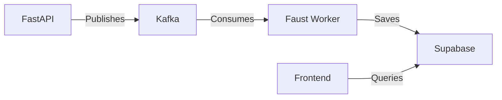

# Faust Worker for Gibsey

This is the Faust worker service that processes gift events from Kafka and saves them to the database.

## Overview

The Faust worker is responsible for:

1. Consuming messages from the `gift_events` Kafka topic
2. Processing and validating the messages
3. Saving the gift events to the Supabase database
4. Handling errors and retries

## Architecture



## Getting Started

### Prerequisites

- Docker and Docker Compose
- Python 3.9+
- Access to a Kafka broker (included in the dev environment)
- Supabase credentials

### Environment Variables

The following environment variables need to be set:

- `KAFKA_BOOTSTRAP_SERVERS`: Comma-separated list of Kafka brokers (default: `kafka:9092`)
- `SUPABASE_URL`: Your Supabase project URL
- `SUPABASE_ANON_KEY`: Your Supabase anonymous/public key

### Running the Worker

1. Start the development environment:

```bash
docker-compose -f infra/compose.yaml up -d
```

2. The Faust worker will start automatically and begin processing messages.

### Testing

To test the worker, you can use the included test script:

```bash
./scripts/test_faust_worker.sh
```

This will:
1. Start the required services
2. Send a test message to the `gift_events` topic
3. Check the Faust worker logs to verify the message was processed

## Development

### Adding New Event Types

1. Define a new topic in `app/faust_worker.py`
2. Create a new agent function to handle the event type
3. Add the necessary database operations

### Monitoring

You can monitor the Faust worker logs using:

```bash
docker-compose -f infra/compose.yaml logs -f faust-worker
```

## Production Considerations

- Set appropriate values for `broker_commit_every` and other Faust settings based on your throughput requirements
- Implement proper error handling and dead-letter queues for failed messages
- Monitor the Kafka consumer lag to ensure messages are being processed in a timely manner
- Consider horizontal scaling by running multiple worker instances with the same consumer group ID

## Troubleshooting

### Common Issues

1. **Connection to Kafka fails**: Ensure the Kafka broker is running and accessible
2. **Database connection issues**: Verify the Supabase credentials and network connectivity
3. **Message processing failures**: Check the Faust worker logs for detailed error messages

### Logs

Logs can be viewed using:

```bash
docker-compose -f infra/compose.yaml logs faust-worker
```

## License

This project is licensed under the MIT License - see the [LICENSE](LICENSE) file for details.
